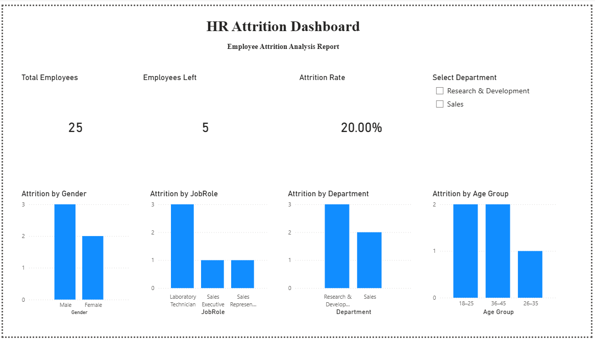

# HR Attrition Analysis Dashboard (Power BI)

## Project Overview
This project analyzes employee attrition patterns using Power BI to identify workforce turnover trends across departments, job roles, gender, and age groups.

## Key Insights
- Overall attrition rate: 20%
- Highest attrition observed in Research & Development
- Laboratory Technician role showed maximum exits
- Higher attrition among employees aged 18–25 and 36–45

## Dashboard Features
- KPI cards (Total Employees, Employees Left, Attrition Rate)
- Department-level filtering using slicer
- Attrition breakdown by Gender, Job Role, Department, and Age Group
- Interactive visual analytics using Power BI

## Tools Used
Power BI | DAX | Data Visualization | Data Modeling

## Dashboard Preview
